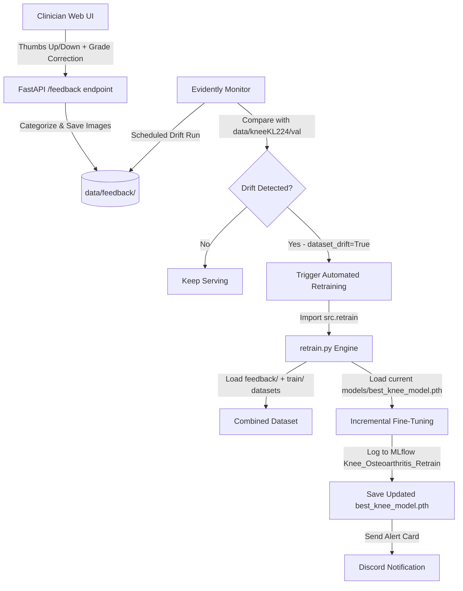

# End-to-End MLOps Workflow

This document describes the complete workflow from data preparation to model deployment, monitoring, and automated retraining in the OA-Prediction-MLOps project.

## Overview

The workflow follows a closed-loop MLOps pipeline divided into five main phases:
1. **Data Engineering & Preparation**
2. **Model Development & Training**
3. **Deployment & Serving**
4. **Monitoring & Maintenance (Data Drift, Tracking & Alerting)**
5. **Continuous Training (CT) & Automated Retraining**

---

## Phase 1: Data Engineering & Preparation

### Objective
Prepare clean, structured data for model training with proper handling of class imbalance.

### Steps
1. **Data Collection**: 
   - Source: KneeKL224 dataset from Mendeley (https://data.mendeley.com/datasets/56rmx5bjcr/1)
   - Format: X-ray images organized by KL grade (0-4)

2. **Data Structure**:
   ```text
   data/
   └── kneeKL224/
       ├── train/
       │   ├── 0/
       │   ├── 1/
       │   ├── 2/
       │   ├── 3/
       │   └── 4/
       ├── val/
       │   ├── 0/
       │   ├── 1/
       │   ├── 2/
       │   ├── 3/
       │   └── 4/
       └── test/
           ├── 0/
           ├── 1/
           ├── 2/
           ├── 3/
           └── 4/
   ```
   *Note: Due to size constraints, only `data/kneeKL224/test` is tracked via DVC. The full dataset should be downloaded separately for training.*

3. **Data Processing** (`src/data_loader.py`):
   - Custom `KneeDataset` class loads images and labels.
   - Image transforms: Resize to $224 \times 224$, normalization (ImageNet standards), and augmentation (random rotation and horizontal flip for training dataset only).
   - Stratified sampling to maintain class distribution during subset creation.
   - `WeightedRandomSampler` to handle class imbalance dynamically.
   - Train/validation split with configurable fraction (default 0.02 for fast testing, 1.0 for full runs).

### Output
- PyTorch DataLoaders for training and validation.
- Class weights for the CrossEntropyLoss function to address class imbalance.

---

## Phase 2: Model Development & Training

### Objective
Develop and train an osteoarthritis classification model using transfer learning.

### Steps
1. **Model Selection**:
   - Architecture: EfficientNet-B0 (pretrained on ImageNet).
   - Feature extraction layers frozen for faster training on CPU.
   - Custom classifier head for 5-class classification (KL grades 0-4).

2. **Configuration** (`configs/config.yml`):
   ```yaml
   data:
     dataset_name: "kneeKL224"
     num_classes: 5
     class_names: ['0', '1', '2', '3', '4']
     img_size: 224
     fraction: 0.02  # 2% for fast testing, 1.0 for full training
   
   model:
     name: "efficientnet_b0"
     pretrained: true
     freeze_feature_layers: true
   
   train:
     batch_size: 8
     epochs: 1
     learning_rate: 0.0001
     device: "auto"  # auto-detects CUDA
     save_name: "best_knee_model.pth"
     mlflow_exp_name: "Knee_Osteoarthritis_Dev"
   ```

3. **Model Building** (`src/model.py`):
   - Loads pretrained EfficientNet-B0.
   - Freezes feature layers if configured.
   - Replaces classifier head with dropout and linear layer.

4. **Training Process** (`src/train.py`):
   - Loads data via `get_data_loaders()` from `data_loader.py`.
   - Initializes model, loss function (weighted CrossEntropyLoss), optimizer.
   - Training loop with validation after each epoch.
   - Saves best model based on validation accuracy to `models/best_knee_model.pth`.
   - Logs metrics and curve plots to MLflow.
   - Sends training completion summaries to Discord.

---

## Phase 3: Deployment & Serving

### Objective
Deploy the trained model as a REST API with a user-friendly web interface.

### Steps
1. **API Development** (`deployment/api/main.py`):
   - FastAPI application with CORS middleware.
   - Model loading on startup (singleton pattern).
   - `/predict` endpoint:
     * Accepts image file upload.
     * Validates input: rejects non-knee X-rays (variance, gray-scale ratio, Hough lines, MobileNet small validation check).
     * Preprocesses image (resize, normalize).
     * Runs inference to get prediction and confidence.
     * Generates Grad-CAM heatmap for explainability.
     * Returns JSON with prediction, confidence, and base64-encoded heatmap.
   - `/feedback` endpoint to process clinician votes and route target files to feedback folders.
   - Health check endpoint (`/health`).

2. **Docker Containerization** (`deployment/docker/`):
   - Root `Dockerfile`:
     * Base image: `python:3.9-slim`.
     * Installs system dependencies and python dependencies.
     * Installs CPU-only PyTorch to speed up builds and reduce image sizes.
     * Exposes port `7860` for Hugging Face Spaces.
     * Runs `uvicorn deployment.api.main:app --host 0.0.0.0 --port 7860`.

3. **CI/CD Pipeline** (`.github/workflows/`):
   - `ci.yml`: Automated testing and linting on pull requests.
   - `cd.yml`: Automated Docker image building and pushing to GitHub Container Registry (GHCR).
   - Pipelines report status directly to Discord via rich, styled cards on the `#ci-cd_alerts` channel.
   - Hugging Face Spaces deployment is handled via a dual-remote Git setup (`git push origin main` pushes to both GitHub and HF Spaces).

4. **Web Interface** (`deployment/web_ui/`):
   - Simple HTML/CSS/JS interface with drag-and-drop upload.
   - JavaScript sends images to `/predict` and renders the Grad-CAM heatmap overlay.
   - Feedback controls (thumbs up/down + grade selector dropdown) allow clinicians to correct predictions and submit corrections.

5. **Dynamic Model Downloading on Startup**:
   - To keep the Git repository lightweight while avoiding local DVC cache limitations on remote build servers, the API implements a dynamic model fetching system on startup:
     * On launch, the app checks if `models/best_knee_model.pth` exists locally on the disk.
     * If the model file is missing, it attempts to download the weights from remote sources in the following priority order:
       1. **Public Download URL (`MODEL_DOWNLOAD_URL`)**: Downloads the binary file directly from a specified URL secret (e.g., DagsHub raw file link, OneDrive, or GitHub Release).
       2. **MLflow Remote Server**: Connects to the MLflow Remote Tracking Server (DagsHub/Hugging Face) using credentials (`MLFLOW_TRACKING_URI`, `MLFLOW_TRACKING_USERNAME`, `MLFLOW_TRACKING_PASSWORD`), queries all registered runs under `Knee_Osteoarthritis_Dev` sorted by `val_acc` descending, identifies the best run containing the model artifact, and downloads the `best_knee_model.pth` file.
     * The downloaded model is cached locally on the container filesystem for subsequent runs, ensuring zero downtime and fully automated server bootstrapping.

### Output
- Production Space page at https://huggingface.co/spaces/bindeptrai/OA-PREDICTON-MLOps.
- Interactive Web UI served by FastAPI at the Space app root.
- API documentation available at `/docs` on the Space app URL.

---

## Phase 4: Monitoring & Maintenance

### Objective
Ensure model performance and data health remain stable over time, detect drift issues early, and alert engineering teams of production anomalies.

### 1. Data Version Control (DVC)
* **Purpose**: Machine learning models and datasets are heavy and binary, making them unsuitable for Git tracking (which bloats repo size and degrades performance). DVC separates code tracking (handled by Git) from data tracking.
* **Mechanism**:
  - Pointers (e.g., `data/kneeKL224/test.dvc`, `models/best_knee_model.pth.dvc`) contain the hash of the actual files and are tracked by Git.
  - The actual data is stored in the remote cache directory (`dvc_remote/` in this project, which can be linked to AWS S3, Google Cloud Storage, or DagsHub storage).
  - Developers retrieve the dataset and weights using `dvc pull`.
  - This ensures git checkouts remain instantaneous and lightweight, while still maintaining complete reproducibility of data versions and model weights.

### 2. Data Drift & Datashift Detection (Evidently AI)
* **Concept**: Data Drift (or Datashift) occurs when the statistical properties of production input data diverge from the training data over time. In medical imaging, this could be caused by new X-ray machines with different exposure settings, new patient demographics, or variation in image resolutions.
* **Feature Extraction**:
  Because statistical tests cannot be run directly on high-dimensional raw pixel arrays, `monitoring/drift_detection.py` extracts lower-dimensional metadata and statistical image features:
  - **Brightness**: The mean pixel intensity of the grayscale image. Represents exposure and lighting variations.
  - **Contrast**: The standard deviation of pixel intensities. Captures the dynamic range of the scans.
  - **Sharpness**: Calculated using the variance of the Laplacian filter after resizing the image to a standardized $224 \times 224$ scale. Standardizing ensures image resolution does not artificially bias sharpness statistics.
  - **Shape Metrics**: Image height, width, and aspect ratio to detect resolution drift or aspect ratio distortions.
* **Statistical Drift Metrics**:
  - Evidently AI compares the **Reference Dataset** (`data/kneeKL224/val`) with the **Current Dataset** (clinician feedback images in `data/feedback/`).
  - It runs non-parametric statistical tests (like the Kolmogorov-Smirnov test for numerical features) on each image property.
  - If the $p$-value falls below a threshold (default $0.05$), the feature is flagged as drifted.
  - If the proportion of drifted features exceeds the configured `threshold` (default $33\%$, or $0.33$), the system flags the entire dataset as drifted (`dataset_drift = True`).
* **Outputs**:
  - HTML Dashboard: `monitoring/reports/drift_report.html` (interactive visualizations of feature distributions).
  - JSON Data: `monitoring/reports/drift_report.json` (raw metrics for automated parsing).

### 3. MLflow Experiment Tracking
* **Purpose**: Centralized tracking for experiments to compare parameters, hyperparameter runs, loss curves, and model weights.
* **Features**:
  - Supports **Local Tracking** (stored in `experiments/mlruns/`) and **Remote Tracking** (via `MLFLOW_TRACKING_URI` pointing to platforms like DagsHub or Hugging Face).
  - Logs hyperparameter choices (learning rate, freeze settings, epochs) and training metrics (loss, accuracy) per epoch.
  - Stores model weight binaries (`best_knee_model.pth`) and training curve visual plots as artifacts inside the run.
  - Keeps training history completely auditable and models deployable directly from registry paths.

### 4. Discord Alerting Engine
A two-tier Discord notification webhook system acts as the real-time command center:
* **🚨 Red Alerts (#api-alerts)**: Sends instant embed alerts on critical infrastructure events:
  - FastAPI 500 errors (unhandled exceptions).
  - Model startup loading failures.
  - Rate limiting (429 status code) or file upload size abuse (>5MB).
  - Dataset Drift alarms triggered by Evidently AI.
* **📊 Gold Tier (#ai-predictions)**: Logs successful predictions (Status 200) with the uploaded X-ray image, predicted KL Grade, confidence score, and processing latency. Allows clinicians and engineers to monitor live prediction distributions visually.

---

## Phase 5: Continuous Training (CT) & Automated Retraining

### Objective
Close the MLOps loop by automatically adapting the model to new production patterns and clinician corrections without manual developer intervention.



### Steps
1. **Clinician Feedback Collection**:
   - The user or clinician flags incorrect predictions in the Web UI, specifying the correct grade (0-4).
   - The FastAPI `/feedback` endpoint routes correct predictions to `data/feedback/correct/{predicted_grade}/` and incorrect predictions to `data/feedback/incorrect/grade_{corrected_grade}/`.

2. **Automated Drift-Retrain Trigger**:
   - During scheduled monitoring checks, `monitoring/drift_detection.py` processes the feedback folders.
   - If statistical drift is detected, the script triggers the retraining pipeline in `src/retrain.py`.

3. **Incremental Fine-Tuning Pipeline**:
   - **Combined Dataset**: The pipeline dynamically creates a `FeedbackDataset` and merges it with the baseline training set (`ConcatDataset`), maintaining class balance via a `WeightedRandomSampler` calculated across the combined dataset.
   - **Fine-Tuning**: It loads the existing weights from `models/best_knee_model.pth` and applies a lower learning rate ($5.0 \times 10^{-5}$) to incrementally adapt the model weights.
   - **Validation**: The model is validated against the untouched validation dataset loader to ensure it maintains generalizeability.
   - **Artifact & Weight Updates**: The new best weights are overwritten back to `models/best_knee_model.pth`, and parameters are logged under the `Knee_Osteoarthritis_Retrain` experiment in MLflow.
   - **Discord Notification**: An automated embed is sent to Discord detailing the retraining status, the number of feedback images used, and final accuracy.

---

## Complete End-to-End MLOps Example

1. **Data Preparation**:
   - Pull test dataset and model using DVC: `dvc pull`
   - Setup project: `pip install -r requirements.txt`

2. **Model Training**:
   - Run `python -m src.train` (tracks metrics in MLflow and alerts Discord upon completion).

3. **Serving & Feedback**:
   - Start container: `docker compose -f deployment/docker/docker-compose.yml up --build`
   - Upload knee X-ray via UI at http://localhost:7860.
   - Click "Sai" (Incorrect) on Web UI, choose corrected grade "3", and click Submit.
   - File is archived in `data/feedback/incorrect/grade_3/`.

4. **Drift & Retraining Simulation**:
   - Run monitoring command with feedback generation and a sensitive drift threshold:
     ```bash
     python -m monitoring.drift_detection --generate-feedback --threshold 0.1
     ```
   - Evidently detects statistical brightness shift.
   - Automatically kicks off `src/retrain.py`.
   - Fine-tunes model on combined dataset (baseline + feedback images), updates `models/best_knee_model.pth`, logs to MLflow, and reports success to Discord!

This provides a fully closed-loop, automated MLOps pipeline.

## Configuration Points

- **Fast vs Full Training**: Adjust `fraction` in `configs/config.yml`
  - 0.02 = 2% of data (fast testing)
  - 1.0 = 100% of data (full training)
  
- **Device Selection**: Set `train.device` to "auto", "cuda", or "cpu"
  
- **Model Architecture**: Change `model.name` to other torchvision models
  
- **Training Parameters**: Modify batch_size, epochs, learning_rate as needed

This workflow provides a complete MLOps pipeline that can be extended with advanced monitoring, automated retraining, and production-grade deployment practices.
